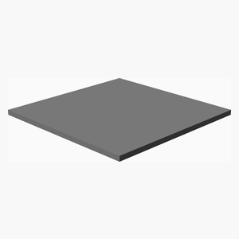

# Microflight

---
## Table of Contents
1. [Parts list](#Parts_list)
1. [Main Assembly](#main_assembly)

[Top](#TOP)

---

## Parts list
| Main | TOTALS |  |
|---:|---:|:---|
|  | | **3D printed parts** |
| &nbsp;&nbsp;1&nbsp; |  &nbsp;&nbsp;1&nbsp; | &nbsp;&nbsp;Base.stl |
| &nbsp;&nbsp;1&nbsp; |  &nbsp;&nbsp;1&nbsp; | &nbsp;&nbsp;Timber.stl |
| &nbsp;&nbsp;3&nbsp; |  &nbsp;&nbsp;3&nbsp; | &nbsp;&nbsp;Tripod.stl |
| &nbsp;&nbsp;3&nbsp; |  &nbsp;&nbsp;3&nbsp; | &nbsp;&nbsp;TripodHead.stl |
| &nbsp;&nbsp;8&nbsp; | &nbsp;&nbsp;8&nbsp; | &nbsp;&nbsp;Total 3D printed parts count |

[Top](#TOP)

---

## Main Assembly
### 3D Printed parts

| 1 x Base.stl | 1 x Timber.stl | 3 x Tripod.stl |
|---|---|---|
|  |  |  

| 3 x TripodHead.stl |
|---|
|  

### Assembly instructions

[Top](#TOP)
